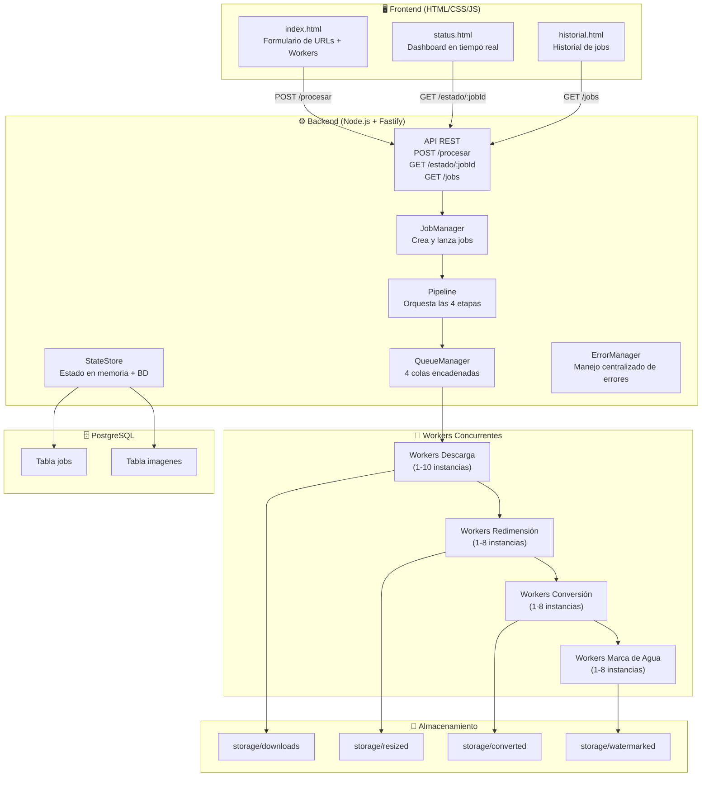
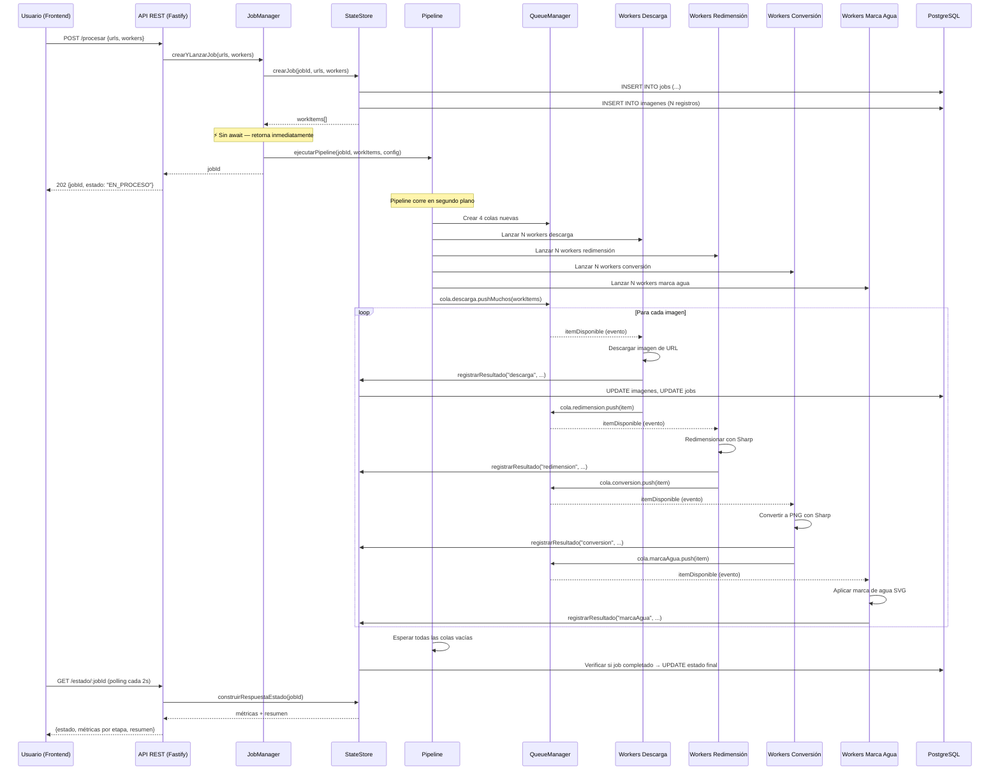
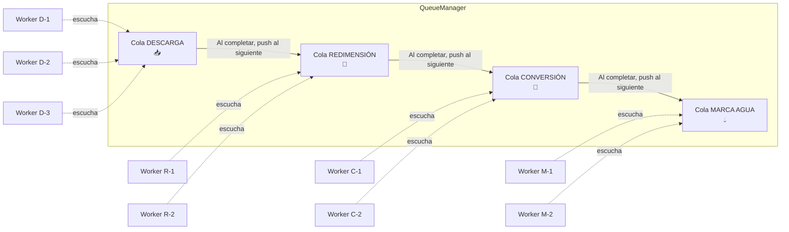
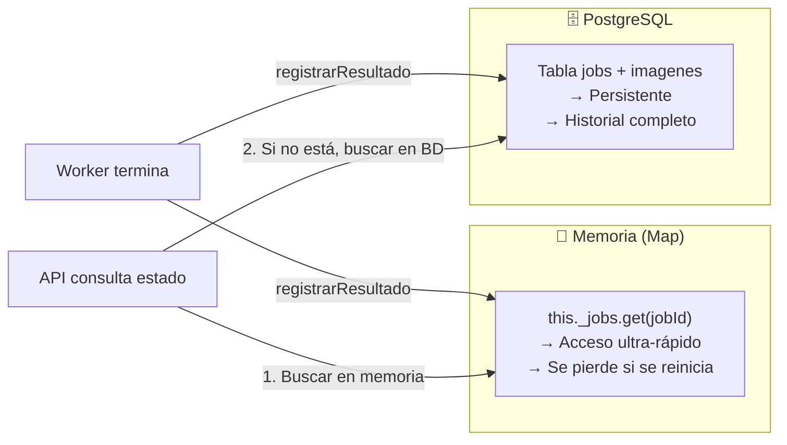
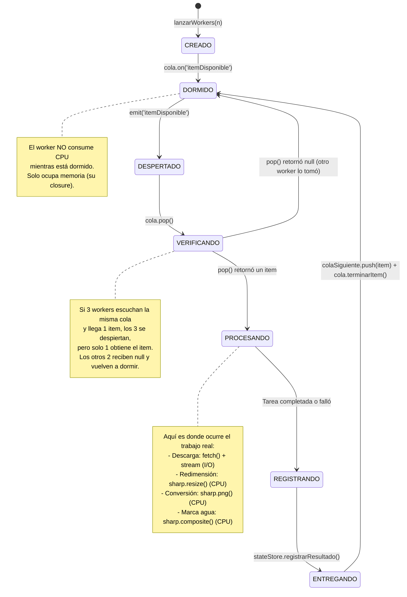

# 🖼️ Análisis Completo del Sistema PMIC

## Plataforma de Procesamiento Masivo de Imágenes Concurrente

> [!IMPORTANT]
> Este sistema es un **taller de sistemas distribuidos** enfocado en **hilos y procesos concurrentes**. Demuestra cómo procesar cientos de imágenes en paralelo usando un patrón **Pipeline + Colas + Workers**.

---

## 📌 ¿Qué hace este sistema en una frase?

**Recibe una lista de URLs de imágenes, las descarga, redimensiona, convierte a PNG y les pone marca de agua — todo DE FORMA CONCURRENTE usando múltiples workers que trabajan en paralelo a través de colas.**

---

## 🏗️ Arquitectura General



---

## 🔄 Flujo Completo del Sistema (Paso a Paso)



---

## 📂 Estructura del Proyecto

```
-PMIC/
├── backend/
│   ├── .env                          ← Variables de entorno
│   ├── package.json                  ← Dependencias (Fastify, Sharp, pg, etc.)
│   └── src/
│       ├── app.js                    ← 🚀 Punto de entrada: arranca todo
│       ├── server.js                 ← Configura Fastify (CORS, Swagger, rutas)
│       ├── config/
│       │   └── config.js             ← Lee variables de .env
│       ├── api/
│       │   ├── routes/
│       │   │   ├── index.js          ← Registra todas las rutas
│       │   │   ├── procesar.route.js ← POST /api/v1/procesar
│       │   │   ├── estado.route.js   ← GET  /api/v1/estado/:jobId
│       │   │   └── historial.route.js← GET  /api/v1/jobs
│       │   ├── controllers/
│       │   │   ├── procesar.controller.js  ← Lanzar nuevo job
│       │   │   ├── estado.controller.js    ← Consultar estado
│       │   │   └── historial.controller.js ← Listar historial
│       │   └── schemas/
│       │       ├── procesar.schema.js ← Validación del body
│       │       └── estado.schema.js   ← Validación de respuesta
│       ├── core/                      ← 🧠 CEREBRO DEL SISTEMA
│       │   ├── jobManager.js          ← Crea jobs y lanza pipeline
│       │   ├── pipeline.js            ← Orquesta las 4 etapas
│       │   ├── stateStore.js          ← Estado en memoria + BD
│       │   └── errorManager.js        ← Manejo centralizado de errores
│       ├── queues/
│       │   └── queueManager.js        ← 📬 Colas con eventos (CLAVE)
│       ├── workers/                   ← 👷 WORKERS CONCURRENTES
│       │   ├── download.worker.js     ← Etapa 1: Descarga
│       │   ├── resize.worker.js       ← Etapa 2: Redimensión
│       │   ├── convert.worker.js      ← Etapa 3: Conversión
│       │   └── watermark.worker.js    ← Etapa 4: Marca de agua
│       ├── database/
│       │   ├── db.js                  ← Pool de conexiones PostgreSQL
│       │   ├── migrations.js          ← Crea tablas jobs + imagenes
│       │   └── repositories/
│       │       ├── job.repository.js     ← CRUD sobre tabla jobs
│       │       └── imagen.repository.js  ← CRUD sobre tabla imagenes
│       └── utils/
│           ├── file.utils.js          ← (vacío, reservado)
│           └── image.utils.js         ← (vacío, reservado)
│
└── frontend/
    ├── index.html         ← Formulario para enviar URLs
    ├── status.html        ← Dashboard de métricas en tiempo real
    ├── historial.html     ← Historial de todos los jobs
    ├── css/
    │   ├── styles.css     ← Estilos principales
    │   └── historial.css  ← Estilos del historial
    └── js/
        ├── api.js         ← Funciones fetch hacia la API
        ├── app.js         ← Lógica del formulario
        ├── metrics.js     ← Polling cada 2s para actualizar métricas
        └── historial.js   ← Carga y filtra historial de jobs
```

---

## 🧠 Componentes del Backend — Desmenuzados

### 1. `app.js` — Punto de Entrada

```javascript
async function start() {
  // 1. Crear carpetas de storage
  // 2. Conectar PostgreSQL (si falla → process.exit(1))
  // 3. Crear tablas (migraciones)
  // 4. Construir y arrancar servidor Fastify
}
```

**¿Qué hace?** Es el `main()` del sistema. Arranca en orden:
1. Crea las 4 carpetas de almacenamiento (`downloads`, `resized`, `converted`, `watermarked`)
2. Verifica que PostgreSQL esté accesible
3. Ejecuta las migraciones para crear las tablas
4. Levanta el servidor HTTP en el puerto 3000

---

### 2. `server.js` — Configuración de Fastify

**¿Qué hace?** Configura el framework web:
- **CORS** → Permite que el frontend (que corre en otro puerto/archivo) llame a la API
- **Swagger** → Documentación automática en `http://localhost:3000/docs`
- **Rutas** → Registra los 3 endpoints de la API
- **Error Handler** → Manejo global de errores de validación

---

### 3. `jobManager.js` — El Lanzador de Jobs

```javascript
class JobManager {
  async crearYLanzarJob(urls, workersConfig) {
    const jobId = uuidv4();                    // ID único
    const workItems = await stateStore.crearJob(jobId, urls, workersConfig);  // Persistir en BD
    
    // ⚡ CLAVE: Sin await → el pipeline corre en SEGUNDO PLANO
    ejecutarPipeline(jobId, workItems, workersConfig)
      .catch(error => { /* log error */ });
    
    return jobId;  // Retorna inmediatamente
  }
}
```

> [!TIP]
> **Concepto clave de concurrencia:** La línea `ejecutarPipeline(...)` se ejecuta **SIN `await`**. Esto significa que la API responde **inmediatamente** al usuario con el `jobId`, mientras el procesamiento pesado corre en segundo plano. Esto es el patrón **fire-and-forget** o **async job processing**.

---

### 4. `pipeline.js` — El Orquestador del Pipeline

```javascript
export async function ejecutarPipeline(jobId, workItems, workersConfig) {
  const qm = new QueueManager();  // Cola fresca por cada job

  // Lanzar workers para cada etapa (como "hilos" escuchando)
  lanzarWorkersDescarga(workersConfig.descarga, jobId, qm);
  lanzarWorkersRedimension(workersConfig.redimension, jobId, qm);
  lanzarWorkersConversion(workersConfig.conversion, jobId, qm);
  lanzarWorkersMarcaAgua(workersConfig.marcaAgua, jobId, qm);

  // Empujar todas las URLs a la cola de descarga
  qm.descarga.pushMuchos(workItems);

  // Esperar que cada etapa termine SECUENCIALMENTE
  await qm.descarga.esperarVacia();
  await qm.redimension.esperarVacia();
  await qm.conversion.esperarVacia();
  await qm.marcaAgua.esperarVacia();
}
```

> [!IMPORTANT]
> **Esto es el CORAZÓN del sistema de concurrencia.** Fíjate que:
> 1. Se lanzan **N workers por etapa** (como "hilos virtuales")
> 2. Se empujan todos los items a la primera cola
> 3. Cuando un worker de descarga termina un item, lo empuja a la cola de redimensión
> 4. Los workers de redimensión ya están escuchando y lo toman inmediatamente
> 5. Y así sucesivamente → **las etapas se solapan en el tiempo**

---

### 5. `queueManager.js` — Las Colas con Eventos (⭐ Pieza Central)



La clase `Queue` extiende `EventEmitter` y usa **dos eventos clave**:

| Evento | ¿Cuándo se emite? | ¿Quién escucha? |
|--------|-------------------|-----------------|
| `itemDisponible` | Cuando se hace `push()` o `pushMuchos()` | Los workers de esa etapa |
| `colaVacia` | Cuando no hay items pendientes ni activos | El pipeline, para saber que la etapa terminó |

```javascript
class Queue extends EventEmitter {
  push(item) {
    this._items.push(item);   // Agregar a la cola
    this._total += 1;
    this.emit('itemDisponible');  // ¡Despertar a un worker!
  }

  pop() {
    if (this._items.length === 0) return null;
    this._activos += 1;  // Marcar como "en procesamiento"
    return this._items.shift();  // FIFO
  }

  terminarItem() {
    this._activos -= 1;
    if (this._items.length === 0 && this._activos === 0) {
      this.emit('colaVacia');  // ¡Todos terminaron!
    }
  }

  esperarVacia() {
    return new Promise(resolve => {
      if (this.estaVacia) resolve();
      else this.once('colaVacia', resolve);
    });
  }
}
```

> [!NOTE]
> **Concepto de Sistemas Distribuidos:** Esto implementa el patrón **Producer-Consumer con colas de mensajes**. La cola desacopla a los productores (workers de la etapa anterior) de los consumidores (workers de la etapa actual). Los `EventEmitter` actúan como el mecanismo de **señalización/wake-up** para los "hilos".

---

### 6. Workers — Los "Hilos" que Procesan

Todos los workers siguen el **mismo patrón**:

```javascript
// 1. Se lanzan N instancias por etapa
export function lanzarWorkersDescarga(n, jobId, qm) {
  for (let i = 1; i <= n; i++) {
    escucharCola(`Descarga-W${i}`, jobId, qm);  // Cada worker tiene un nombre
  }
}

// 2. Cada worker escucha eventos de la cola
function escucharCola(workerNombre, jobId, qm) {
  const cola = qm.descarga;

  cola.on('itemDisponible', async () => {
    const item = cola.pop();        // Tomar un item de la cola
    if (!item) return;               // Otro worker ya lo tomó (condición de carrera)
    item.workerNombre = workerNombre;
    await procesarDescarga(item, qm); // Hacer el trabajo pesado
    cola.terminarItem();              // Marcar como terminado
  });
}

// 3. Procesar y pasar al siguiente
async function procesarDescarga(item, qm) {
  try {
    // ... descargar imagen ...
    await stateStore.registrarResultado(...);  // Actualizar BD + memoria
    qm.redimension.push(item);                // → Siguiente etapa
  } catch (error) {
    await errorManager.registrarError('descarga', item, error, tiempoSeg);
  }
}
```

#### Las 4 Etapas de Procesamiento:

| Etapa | Worker | ¿Qué hace? | Tipo | Herramienta |
|-------|--------|------------|------|-------------|
| **1. Descarga** | `download.worker.js` | Descarga la imagen desde la URL usando `fetch` | **I/O-bound** (red) | `fetch` + `stream` |
| **2. Redimensión** | `resize.worker.js` | Reduce la imagen a máximo 800px | **CPU-bound** | `sharp.resize()` |
| **3. Conversión** | `convert.worker.js` | Convierte cualquier formato a PNG | **CPU-bound** | `sharp.png()` |
| **4. Marca de agua** | `watermark.worker.js` | Superpone texto SVG "PMIC © 2024" | **CPU-bound** | `sharp.composite()` |

> [!TIP]
> **‿I/O-bound vs CPU-bound** es un concepto fundamental:
> - **I/O-bound (Descarga):** El worker pasa la mayoría del tiempo *esperando* datos de la red. Poner más workers es muy eficiente porque mientras uno espera, otros trabajan.
> - **CPU-bound (Redimensión, Conversión, Marca de agua):** El worker pasa el tiempo *calculando*. Poner demasiados workers en un solo núcleo no ayuda mucho. Por eso la descarga permite hasta 10 workers, pero las demás solo 8.

---

### 7. `stateStore.js` — Estado Dual (Memoria + BD)



**¿Por qué doble?**
- **Memoria:** Para consultas rápidas del dashboard en tiempo real (polling cada 2 segundos)
- **BD:** Para persistencia, historial, y consultas cuando la app se reinicia

---

### 8. `errorManager.js` — Manejo de Errores Centralizado

```javascript
class ErrorManager {
  async registrarError(etapa, workItem, error, tiempoSeg) {
    // 1. Log en consola con contexto (etapa, jobId, imagenId, error)
    // 2. Registrar en stateStore (actualiza BD + memoria con estado ERROR_*)
    // 3. ¡El pipeline NO se detiene! → continúa con las demás imágenes
  }
}
```

> [!IMPORTANT]
> **Diseño resiliente:** Si una imagen falla en cualquier etapa, el error se registra pero el sistema **CONTINÚA procesando las demás imágenes**. No se detiene todo por un fallo individual. Esto es fundamental en sistemas distribuidos: **tolerancia a fallos parciales**.

---

## 🗄️ Base de Datos — Modelo de Datos

### Tabla `jobs`

| Columna | Tipo | Descripción |
|---------|------|-------------|
| `job_id` | TEXT PK | UUID del job |
| `estado` | TEXT | `EN_PROCESO`, `COMPLETADO`, `COMPLETADO_CON_ERRORES`, `FALLIDO` |
| `fecha_inicio` | TIMESTAMPTZ | Cuándo empezó |
| `fecha_fin` | TIMESTAMPTZ | Cuándo terminó |
| `urls_totales` | INTEGER | Cuántas URLs se recibieron |
| `workers_descarga` | INTEGER | N workers configurados para descarga |
| `workers_redimension` | INTEGER | N workers para redimensión |
| `workers_conversion` | INTEGER | N workers para conversión |
| `workers_marca_agua` | INTEGER | N workers para marca de agua |
| `desc_procesados/fallidos/tiempo_total` | - | Métricas acumuladas etapa 1 |
| `redi_procesados/fallidos/tiempo_total` | - | Métricas acumuladas etapa 2 |
| `conv_procesados/fallidos/tiempo_total` | - | Métricas acumuladas etapa 3 |
| `agua_procesados/fallidos/tiempo_total` | - | Métricas acumuladas etapa 4 |

### Tabla `imagenes`

| Columna | Tipo | Descripción |
|---------|------|-------------|
| `imagen_id` | TEXT PK | UUID de la imagen |
| `job_id` | TEXT FK → jobs | A qué job pertenece |
| `url_original` | TEXT | La URL de donde se descarga |
| `estado` | TEXT | Progresa: `PENDIENTE` → `DESCARGADA` → `REDIMENSIONADA` → `CONVERTIDA` → `COMPLETADA` |
| `ruta_descargada` | TEXT | Ruta del archivo descargado |
| `ruta_redimensionada` | TEXT | Ruta del archivo redimensionado |
| `ruta_convertida` | TEXT | Ruta del archivo convertido |
| `ruta_marca_agua` | TEXT | Ruta del archivo final |
| `error_*` | TEXT | Mensaje de error si falló en esa etapa |
| `worker_*` | TEXT | Nombre del worker que la procesó |
| `tiempo_*_seg` | NUMERIC | Cuánto tardó cada etapa |

---

## 🌐 API REST — Los 3 Endpoints

### `POST /api/v1/procesar`

**Propósito:** Iniciar un nuevo job de procesamiento

```json
// Request Body
{
  "urls": [
    "https://ejemplo.com/imagen1.jpg",
    "https://ejemplo.com/imagen2.png"
  ],
  "workers": {
    "descarga": 3,
    "redimension": 2,
    "conversion": 2,
    "marcaAgua": 2
  }
}

// Response 202 (Accepted)
{
  "jobId": "a1b2c3d4-...",
  "mensaje": "Pipeline iniciado correctamente",
  "totalImagenes": 2,
  "estado": "EN_PROCESO",
  "fechaInicio": "2026-03-09T..."
}
```

> Retorna **202 Accepted** (no 200 OK) porque el trabajo AÚN NO terminó, solo fue aceptado.

### `GET /api/v1/estado/:jobId`

**Propósito:** Consultar métricas en tiempo real de un job

```json
// Response 200
{
  "jobId": "a1b2c3d4-...",
  "estado": "EN_PROCESO",
  "tiempoTotalSeg": 12.45,
  "metricasDescarga": {
    "nombreEtapa": "DESCARGA",
    "totalProcesados": 15,
    "totalFallidos": 1,
    "tiempoAcumuladoSeg": 8.23,
    "tiempoPromedioSeg": 0.59
  },
  // ... métricas de las otras 3 etapas ...
  "resumenGlobal": {
    "totalRecibidos": 20,
    "totalConError": 2,
    "porcentajeExito": 90.0,
    "porcentajeFallo": 10.0
  }
}
```

### `GET /api/v1/jobs`

**Propósito:** Listar historial de todos los jobs procesados

---

## 🖥️ Frontend — Las 3 Páginas

### `index.html` — Formulario de envío
- TextArea para pegar URLs (una por línea)
- Contadores de workers ajustables con botones `+` / `−`
- Validaciones del lado del cliente (URLs válidas, máximo 500)
- Al enviar → guarda `jobId` en `sessionStorage` y redirige a `status.html`

### `status.html` — Dashboard en tiempo real
- Hace **polling** al endpoint `GET /estado/:jobId` **cada 2 segundos**
- Muestra barras de progreso por etapa
- Badge de estado: `EN PROCESO`, `COMPLETADO`, `CON ERRORES`, `FALLIDO`
- Resumen global: total, completadas, con error, % éxito, % fallo
- **Deja de hacer polling** cuando el estado es final

### `historial.html` — Historial de jobs
- Lista todos los jobs anteriores
- Filtros por texto (Job ID o URL) y por estado
- Acordeón para ver las URLs de cada job con indicador de estado (✓ OK / ✗ Error)
- Botón para ir al detalle de cualquier job

---

## 🔑 Conceptos de Sistemas Distribuidos Implementados

### 1. Patrón Pipeline (Tubería)

```
URL → [DESCARGA] → [REDIMENSIÓN] → [CONVERSIÓN] → [MARCA DE AGUA] → Resultado
```

Cada etapa es un procesador independiente. La salida de una etapa es la entrada de la siguiente. Las etapas pueden ejecutarse **en paralelo** (mientras la descarga procesa la imagen 5, la redimensión puede estar procesando la imagen 3).

### 2. Patrón Producer-Consumer con Colas

```
Productores (etapa N)  →  [Cola]  →  Consumidores (etapa N+1)
```

Las colas desacoplan las etapas. Si la descarga es más rápida que la redimensión, los items se acumulan en la cola y los workers de redimensión los procesan a su ritmo.

### 3. Concurrencia con EventEmitter (Hilos Simulados)

En Node.js no hay hilos reales (es single-threaded), pero los `EventEmitter` + `async/await` simulan concurrencia:
- Cada worker "escucha" el evento `itemDisponible`
- Cuando hay un item, lo toma y procesa
- Mientras espera I/O (descarga de red), el event loop atiende otros workers
- **Sharp** (la librería de imágenes) sí usa hilos del sistema operativo internamente (C++ threads)

### 4. Fire-and-Forget (Procesamiento asíncrono)

La API responde **inmediatamente** con un `jobId`. El procesamiento real ocurre en segundo plano. El cliente hace **polling** para consultar el progreso.

### 5. Estado Dual (Cache en memoria + Persistencia)

- Memoria (`Map`) → Alta velocidad, sin latencia de red
- PostgreSQL → Persistencia, consultas complejas, historial

### 6. Tolerancia a Fallos Parciales

Si una imagen falla en cualquier etapa:
- El error se registra en la BD
- Las demás imágenes **continúan** normalmente
- El estado final refleja si hubo errores: `COMPLETADO_CON_ERRORES`

### 7. Pool de Conexiones

```javascript
const pool = new Pool({ max: 20 });  // Máximo 20 conexiones simultáneas
```

En lugar de crear una conexión a PostgreSQL por cada query, se reutiliza un pool de conexiones. Esto es fundamental cuando hay muchos workers haciendo queries concurrentes.

---

## ⚙️ Tecnologías Usadas

| Tecnología | Propósito |
|-----------|-----------|
| **Node.js** | Runtime del backend (event loop, async I/O) |
| **Fastify** | Framework HTTP rápido (como Express pero más veloz) |
| **Sharp** | Procesamiento de imágenes (redimensión, conversión, composición) — usa C++ internally |
| **PostgreSQL** | Base de datos relacional para persistencia |
| **pg (node-postgres)** | Driver/pool de conexiones a PostgreSQL |
| **EventEmitter** | Mecanismo de señalización entre producers y consumers |
| **UUID** | Generación de identificadores únicos para jobs e imágenes |
| **Swagger** | Documentación automática de la API |
| **Pino** | Logger de alto rendimiento |

---

## 🔬 ¿Dónde están los "Hilos y Procesos"?

| Concepto del taller | Implementación en el código |
|--------------------|-----------------------------|
| **Hilos (threads)** | Los **workers** simulan hilos usando `EventEmitter` + `async/await`. Internamente, Sharp usa threads C++ reales del libuv thread pool |
| **Procesos** | El backend corre como un **solo proceso** Node.js. El pool de PostgreSQL maneja conexiones como "procesos remotos" |
| **Concurrencia** | Múltiples workers procesan imágenes **simultáneamente** gracias al event loop de Node.js |
| **Paralelismo real** | Sharp ejecuta operaciones de imagen en threads nativos del SO (libuv worker threads), logrando paralelismo real en CPU |
| **Sincronización** | Las **colas** actúan como mecanismo de sincronización. `esperarVacia()` es como un **barrier/join** |
| **Sección crítica** | El `pop()` de la cola: si dos workers hacen `pop()` simultáneamente para el mismo item, uno obtiene `null` (protección contra race condition) |
| **Productor-Consumidor** | Cada etapa es un consumidor de la cola anterior y un productor para la cola siguiente |
| **Pipeline** | Las 4 etapas forman un pipeline donde diferentes imágenes están en diferentes etapas al mismo tiempo |

> [!CAUTION]
> **Nota importante sobre Node.js y hilos:** Node.js es single-threaded en su event loop, pero:
> 1. Las operaciones I/O (fetch, fs) son **non-blocking** — se delegan al SO
> 2. Sharp usa el **libuv thread pool** (4 threads por defecto) para operaciones CPU
> 3. PostgreSQL procesa queries en su propio proceso separado
> 
> Por eso el sistema puede procesar múltiples imágenes "al mismo tiempo" aunque sea "un solo hilo".

---

## 📊 Ejemplo de Ejecución

Si envías **10 URLs** con la configuración `descarga: 3, redimension: 2, conversion: 2, marcaAgua: 2`:

```
Tiempo →
Worker D-1: [img1]----[img4]--------[img7]--------[img10]
Worker D-2: [img2]--------[img5]--------[img8]
Worker D-3: [img3]--------[img6]--------[img9]
                ↓              ↓
Worker R-1: ----[img1]--[img3]--[img5]--[img7]--[img9]
Worker R-2: ------[img2]--[img4]--[img6]--[img8]--[img10]
                    ↓              ↓
Worker C-1: ------[img1]--[img3]--[img5]--[img7]--[img9]
Worker C-2: --------[img2]--[img4]--[img6]--[img8]--[img10]
                      ↓              ↓
Worker M-1: --------[img1]--[img3]--[img5]--[img7]--[img9]
Worker M-2: ----------[img2]--[img4]--[img6]--[img8]--[img10]
```

**Las etapas se solapan:** mientras la descarga trabaja en la imagen 7, la redimensión puede estar en la imagen 4, la conversión en la imagen 2, y la marca de agua en la imagen 1. **Esto es el poder del pipeline concurrente.**

---
---

# 👷 SECCIÓN PROFUNDA: LOS WORKERS (HILOS Y PROCESOS)

> Esta sección desglosa **TODO** sobre cómo funcionan los workers en el sistema, línea por línea, y cómo se conectan con la teoría de **hilos y procesos** de sistemas distribuidos.

---

## 1. ¿Qué es un Worker en este sistema?

Un **worker** es una función que se registra como **listener de eventos** en una cola. Simula el comportamiento de un **hilo (thread)** del sistema operativo:

| Hilo del SO | Worker en PMIC |
|-------------|----------------|
| Se crea con `pthread_create()` | Se crea con `escucharCola()` |
| Espera en un `condition_variable.wait()` | Espera el evento `itemDisponible` |
| Se despierta con `condition_variable.notify()` | Se despierta con `emit('itemDisponible')` |
| Lee de un buffer compartido | Lee de `cola.pop()` |
| Usa un `mutex` para exclusión mutua | El event loop de Node.js serializa los accesos |
| Termina con `pthread_join()` | La cola emite `colaVacia` (como un barrier/join) |

---

## 2. Ciclo de Vida Completo de un Worker



### Las 6 fases explicadas:

### Fase 1: CREACIÓN (nacimiento del "hilo")

```javascript
// pipeline.js — Se lanzan N workers por etapa
lanzarWorkersDescarga(workersConfig.descarga, jobId, qm);
//                     ↑ por ejemplo: 3
```

```javascript
// download.worker.js
export function lanzarWorkersDescarga(n, jobId, qm) {
  console.log(`[DESCARGA] Lanzando ${n} workers...`);
  for (let i = 1; i <= n; i++) {
    escucharCola(`Descarga-W${i}`, jobId, qm);
    //           ↑ nombre único: "Descarga-W1", "Descarga-W2", "Descarga-W3"
  }
}
```

**¿Qué pasa aquí?** Se ejecuta un `for` que crea N "escuchadores". Cada iteración es como hacer `pthread_create()` — crea un nuevo "hilo" que va a vivir escuchando la cola.

**Analogía SO:** Es exactamente como cuando haces:
```c
// En C con pthreads (teoría):
for (int i = 0; i < n; i++) {
    pthread_create(&threads[i], NULL, worker_function, &args);
}
```

---

### Fase 2: DORMIDO (esperando trabajo)

```javascript
function escucharCola(workerNombre, jobId, qm) {
  const cola = qm.descarga;

  // ⭐ ESTE .on() es el equivalente a condition_variable.wait()
  cola.on('itemDisponible', async () => {
    // ... este código se ejecuta SOLO cuando alguien hace push() a la cola
  });
}
```

**¿Qué pasa aquí?** El worker se "duerme" esperando el evento `itemDisponible`. No consume CPU, no bloquea nada. Es un **callback registrado** que se activará cuando la cola emita ese evento.

**Analogía SO:**
```c
// En C con pthreads (teoría):
pthread_mutex_lock(&mutex);
while (cola_vacia()) {
    pthread_cond_wait(&cond, &mutex);  // ← Se duerme aquí
}
// Se despierta cuando otro hilo hace pthread_cond_signal()
```

**Diferencia clave:** En un SO real, el hilo se bloquea y el scheduler del kernel lo pone a dormir. En Node.js, el "hilo" no existe realmente — es solo un callback en memoria que el event loop ejecutará cuando llegue el evento.

---

### Fase 3: DESPERTAR (llega trabajo)

Cuando otro componente hace `push()` a la cola:

```javascript
// Esto ocurre en algún otro sitio:
qm.descarga.push(item);  // O pushMuchos()
```

Internamente, `push()` ejecuta:
```javascript
push(item) {
  this._items.push(item);
  this._total += 1;
  this.emit('itemDisponible');  // ← ¡DESPIERTA A TODOS LOS WORKERS!
}
```

**TODOS** los workers registrados con `.on('itemDisponible')` se despiertan. Pero como Node.js es single-threaded, se ejecutan **uno por uno**, no simultáneamente.

**Analogía SO:**
```c
// En C — despertar a TODOS los hilos que esperan:
pthread_cond_broadcast(&cond);  // ← broadcast = despertar a todos
// (distinto de pthread_cond_signal que despierta solo a 1)
```

---

### Fase 4: VERIFICAR (¿hay algo para mí?)

```javascript
cola.on('itemDisponible', async () => {
  const item = cola.pop();  // ← Intentar tomar un item
  if (!item) return;         // ← ¡Otro worker ya lo tomó! Volver a dormir.
  // ...
});
```

```javascript
pop() {
  if (this._items.length === 0) return null;  // Cola vacía
  this._activos += 1;         // Marcar que hay un worker procesando
  return this._items.shift();  // FIFO: sacar el primer item
}
```

**¿Por qué `pop()` puede retornar `null`?** Porque si llega 1 item y hay 3 workers escuchando, los 3 se despiertan. El primero hace `pop()` y obtiene el item. Los otros 2 hacen `pop()` y obtienen `null` → vuelven a dormir.

**Analogía SO — Sección Crítica:**
```c
pthread_mutex_lock(&mutex);           // ← En Node.js: el event loop serializa
item = buffer[read_index++];          // ← En Node.js: this._items.shift()
pthread_mutex_unlock(&mutex);
```

> **¿Por qué no hay race condition?** Porque Node.js ejecuta todo el JavaScript en UN SOLO HILO. Aunque haya 3 workers, sus callbacks se ejecutan uno tras otro, NUNCA simultáneamente. El event loop de Node.js actúa como un **mutex implícito**. Esto es una ventaja sobre los hilos reales donde necesitas locks explícitos.

---

### Fase 5: PROCESAMIENTO (el trabajo pesado)

Aquí es donde cada worker hace su tarea específica:

#### Worker de Descarga (`download.worker.js`) — I/O-BOUND

```javascript
async function procesarDescarga(item, qm) {
  const inicio = Date.now();  // ← Cronómetro

  try {
    // 1. Descargar la imagen de internet
    const response = await fetch(item.urlOriginal, {
      signal: AbortSignal.timeout(30000),  // ← Timeout de 30 segundos
      headers: { 'User-Agent': 'Mozilla/5.0 (compatible; PMIC/1.0)' }
    });
    // ⚡ MIENTRAS ESPERA LA RED, NODE.JS ATIENDE A OTROS WORKERS
    // Esto es lo que hace al worker "concurrente" sin ser un hilo real

    if (!response.ok) {
      throw new Error(`HTTP ${response.status}: ${response.statusText}`);
    }

    // 2. Determinar la extensión del archivo
    const extension = obtenerExtension(item.urlOriginal, response.headers.get('content-type'));
    const nombreArchivo = `${item.imagenId}${extension}`;
    const rutaDestino = path.join(config.storage.downloads, nombreArchivo);

    // 3. Guardar en disco usando STREAMS (eficiente en memoria)
    await streamPipeline(
      response.body,                    // ← Stream de lectura (red)
      fs.createWriteStream(rutaDestino) // ← Stream de escritura (disco)
    );
    // ⚡ DURANTE ESTA ESCRITURA, NODE.JS TAMBIÉN ATIENDE OTROS WORKERS

    // 4. Obtener el tamaño del archivo
    const tamanoMb = fs.statSync(rutaDestino).size / (1024 * 1024);
    const tiempoSeg = (Date.now() - inicio) / 1000;

    // 5. Actualizar el "workItem" para la siguiente etapa
    item.rutaActual = rutaDestino;    // ← La ruta donde quedó el archivo
    item.nombreBase = item.imagenId;
    item.extension = extension;

    // 6. Registrar éxito en BD + memoria
    await stateStore.registrarResultado('descarga', item.imagenId, item.jobId, true, tiempoSeg, {
      estado:       'DESCARGADA',
      workerNombre: item.workerNombre,   // ← "Descarga-W2" (para saber quién lo hizo)
      tiempoSeg,
      ruta:         rutaDestino,
      tamanoMb:     parseFloat(tamanoMb.toFixed(4)),
      error:        null,
    });

    // 7. ⭐ PASAR A LA SIGUIENTE ETAPA
    qm.redimension.push(item);  // ← Empujar a la cola de redimensión

  } catch (error) {
    const tiempoSeg = (Date.now() - inicio) / 1000;
    // Si falla → ErrorManager registra el error y el pipeline CONTINÚA
    await errorManager.registrarError('descarga', item, error, tiempoSeg);
    // ⚠️ NO se hace qm.redimension.push(item) → la imagen NO pasa a la siguiente etapa
  }
}
```

**Puntos clave para el taller:**
- El `await fetch()` es **I/O-bound**: el worker "suelta" el event loop mientras espera la red
- Mientras Worker-D1 espera datos de internet, Worker-D2 puede estar escribiendo en disco
- **3 workers de descarga** pueden descargar 3 imágenes "al mismo tiempo" porque las esperas de red se solapan
- Se usa `streamPipeline` en vez de `response.buffer()` para no cargar toda la imagen en RAM

---

#### Worker de Redimensión (`resize.worker.js`) — CPU-BOUND

```javascript
async function procesarRedimension(item, qm) {
  const inicio = Date.now();

  try {
    // 1. Leer metadatos de la imagen (ancho × alto)
    const metadata = await sharp(item.rutaActual).metadata();
    const anchoOriginal = metadata.width;   // ej: 4000
    const altoOriginal  = metadata.height;  // ej: 3000

    // 2. Calcular nuevas dimensiones (máximo 800px)
    const maxDim = config.pipeline.maxDimension;  // 800
    let anchoFinal = anchoOriginal;
    let altoFinal  = altoOriginal;

    if (anchoOriginal > maxDim || altoOriginal > maxDim) {
      const ratio = Math.min(maxDim / anchoOriginal, maxDim / altoOriginal);
      anchoFinal = Math.round(anchoOriginal * ratio);  // ej: 800
      altoFinal  = Math.round(altoOriginal  * ratio);  // ej: 600
    }

    // 3. Redimensionar con Sharp
    const rutaSalida = path.join(config.storage.resized, `${item.nombreBase}_redimensionado${item.extension}`);
    await sharp(item.rutaActual)
      .resize(anchoFinal, altoFinal, { fit: 'inside', withoutEnlargement: true })
      .toFile(rutaSalida);
    // ⚡ sharp.resize() se ejecuta en el THREAD POOL de libuv (C++)
    // Es PARALELISMO REAL en CPU, no solo concurrencia del event loop

    // 4. Actualizar item para siguiente etapa
    item.rutaActual = rutaSalida;
    item.nombreBase = `${item.nombreBase}_redimensionado`;

    // 5. Registrar resultado + pasar a conversión
    await stateStore.registrarResultado('redimension', item.imagenId, item.jobId, true, tiempoSeg, { ... });
    qm.conversion.push(item);  // ← Siguiente etapa

  } catch (error) {
    await errorManager.registrarError('redimension', item, error, tiempoSeg);
  }
}
```

**Puntos clave para el taller:**
- `sharp()` es una librería de C++ (libvips) que usa el **libuv thread pool**
- Cuando llamas `await sharp().resize().toFile()`, eso se ejecuta en un **hilo nativo real del SO**
- Por defecto libuv tiene **4 threads** → hasta 4 redimensiones pueden ocurrir **en paralelo real** en CPU
- Esto es **verdadero paralelismo**, no solo concurrencia

---

#### Worker de Conversión (`convert.worker.js`) — CPU-BOUND

```javascript
async function procesarConversion(item, qm) {
  const formatoOriginal = item.extension.replace('.', '').toUpperCase(); // "JPG"

  try {
    const rutaSalida = path.join(config.storage.converted, `${item.nombreBase}_formato_cambiado.png`);

    await sharp(item.rutaActual)
      .png({ quality: 90, compressionLevel: 6 })  // ← Convertir a PNG
      .toFile(rutaSalida);

    item.rutaActual = rutaSalida;
    item.extension  = '.png';

    await stateStore.registrarResultado('conversion', ...);
    qm.marcaAgua.push(item);  // ← Siguiente etapa

  } catch (error) {
    await errorManager.registrarError('conversion', item, error, tiempoSeg);
  }
}
```

**Punto clave:** Convierte CUALQUIER formato (JPG, GIF, WebP, BMP) a PNG estandarizado. Misma mecánica de thread pool que redimensión.

---

#### Worker de Marca de Agua (`watermark.worker.js`) — CPU-BOUND

```javascript
async function procesarMarcaAgua(item) {
  try {
    const metadata = await sharp(item.rutaActual).metadata();
    const ancho = metadata.width;
    const alto  = metadata.height;

    // 1. Calcular tamaño de fuente proporcional a la imagen
    const tamanoFuente = Math.max(16, Math.round(ancho / 15));

    // 2. Crear la marca de agua como SVG (texto con sombra)
    const svgMarcaAgua = Buffer.from(`
      <svg width="${ancho}" height="${alto}">
        <text x="${ancho - 20}" y="${alto - 18}" class="sombra">PMIC © 2024</text>
        <text x="${ancho - 22}" y="${alto - 20}" class="marca">PMIC © 2024</text>
      </svg>
    `);

    // 3. Componer la imagen original + la marca de agua
    await sharp(item.rutaActual)
      .composite([{ input: svgMarcaAgua, blend: 'over' }])  // ← Superponer
      .png()
      .toFile(rutaSalida);

    // 4. Registrar como COMPLETADA (última etapa)
    await stateStore.registrarResultado('marcaAgua', item.imagenId, item.jobId, true, tiempoSeg, {
      estado: 'COMPLETADA',  // ← ¡Estado final!
      // ...
    });

    // ⚠️ NO hay qm.siguiente.push(item) — esta es la ÚLTIMA etapa

  } catch (error) {
    await errorManager.registrarError('marcaAgua', item, error, tiempoSeg);
  }
}
```

**Punto clave:** Es la **última etapa** del pipeline. Cuando termina, NO empuja a ninguna cola siguiente. En vez de eso, el `stateStore.registrarResultado()` verifica si TODAS las imágenes del job terminaron y, si es así, marca el job como `COMPLETADO`.

---

### Fase 6: ENTREGA Y VUELTA A DORMIR

```javascript
cola.on('itemDisponible', async () => {
  const item = cola.pop();
  if (!item) return;

  item.workerNombre = workerNombre;
  await procesarDescarga(item, qm);  // ← Fase 5 (procesamiento)
  cola.terminarItem();                // ← ¡Terminé! Decrementar contador
  // El worker "vuelve a dormir" automáticamente — esperará el próximo evento
});
```

```javascript
terminarItem() {
  this._activos -= 1;   // Un worker menos activo
  this._fin += 1;        // Un item más terminado

  // ¿Ya no hay nada pendiente NI nadie procesando?
  if (this._items.length === 0 && this._activos === 0) {
    this.emit('colaVacia');  // ← Señal de que la etapa terminó
    // El pipeline.js está esperando esto con esperarVacia()
  }
}
```

**Analogía SO:**
```c
// En C — el equivalente de terminarItem() + colaVacia:
pthread_mutex_lock(&mutex);
items_activos--;
if (items_activos == 0 && cola_size == 0) {
    pthread_cond_signal(&barrier_cond);  // ← Despertar al pipeline
}
pthread_mutex_unlock(&mutex);
```

---

## 3. El Patron Completo: Cómo los Workers Fluyen entre Colas

```
                        COLA DESCARGA          COLA REDIMENSION       COLA CONVERSION        COLA MARCA AGUA
                     ┌─────────────────┐    ┌─────────────────┐    ┌─────────────────┐    ┌─────────────────┐
Items ingresan →     │ img1 img2 img3  │    │                 │    │                 │    │                 │
                     └────────┬────────┘    └────────┬────────┘    └────────┬────────┘    └────────┬────────┘
                              │                      │                      │                      │
                     ┌────────┴────────┐    ┌────────┴────────┐    ┌────────┴────────┐    ┌────────┴────────┐
Workers:             │ D-W1   D-W2    │    │ R-W1   R-W2    │    │ C-W1   C-W2    │    │ M-W1   M-W2    │
                     │ D-W3           │    │                 │    │                 │    │                 │
                     └─────────────────┘    └─────────────────┘    └─────────────────┘    └─────────────────┘

Paso 1: D-W1 toma img1, D-W2 toma img2, D-W3 toma img3 (CONCURRENTES)
Paso 2: D-W1 termina img1 → push a cola redimensión → R-W1 despierta y toma img1
Paso 3: D-W2 termina img2 → push a cola redimensión → R-W2 despierta y toma img2
        MIENTRAS D-W1 ya está descargando img4 (volvió a la cola de descarga)
Paso 4: R-W1 termina img1 → push a cola conversión → C-W1 despierta y toma img1
        R-W2 aún procesando img2, D-W3 terminó img3 y fue a la cola de redimensión
...y así sucesivamente. TODAS LAS ETAPAS TRABAJAN EN PARALELO.
```

---

## 4. ¿Por qué Workers y no Worker Threads reales de Node.js?

Node.js tiene `worker_threads` (hilos reales). ¿Por qué este sistema NO los usa?

| Aspecto | Worker Threads (hilos reales) | Workers con EventEmitter (este sistema) |
|---------|------------------------------|----------------------------------------|
| **Memoria** | Cada thread consume ~10MB RAM | Cada "worker" es solo un callback (~1KB) |
| **Comunicación** | Necesita `postMessage()` (serializar datos) | Acceso directo a la misma memoria |
| **Complejidad** | Requiere manejo explícito de locks | El event loop serializa automáticamente |
| **I/O concurrente** | Eficiente pero innecesario (Node ya es async) | Naturalmente concurrente con `await` |
| **CPU real** | Paralelismo verdadero | Sharp ya usa threads C++ internamente |
| **Para este taller** | Over-engineering | **Suficiente para demostrar los conceptos** |

**Conclusión:** Este sistema logra **concurrencia efectiva** sin la complejidad de hilos reales, porque:
1. Las descargas son I/O → `await fetch()` ya es no-bloqueante
2. El procesamiento de imágenes usa Sharp → que internamente sí usa threads C++
3. Las colas + EventEmitter manejan la coordinación de forma elegante

---

## 5. Conceptos Académicos Mapeados al Código Worker

### 5.1 Exclusión Mutua (Mutex)

**Teoría:** Solo un hilo puede acceder a un recurso compartido a la vez.

**En el código:**
```javascript
// queueManager.js
pop() {
  if (this._items.length === 0) return null;  // ← Verificación atómica
  this._activos += 1;
  return this._items.shift();  // ← Solo 1 worker obtiene este item
}
```
Node.js garantiza que NO hay dos callbacks ejecutándose a la vez (el event loop es single-threaded), así que `pop()` nunca tiene race conditions. **El event loop ES el mutex.**

### 5.2 Variable de Condición (Condition Variable)

**Teoría:** Un hilo se duerme hasta que otro lo despierta con una señal.

**En el código:**
```javascript
// DORMIR (esperar un item):
cola.on('itemDisponible', async () => { ... });

// DESPERTAR (señal de que hay trabajo):
this.emit('itemDisponible');
```

### 5.3 Barrera (Barrier)

**Teoría:** Un punto de sincronización donde se espera a que TODOS los hilos terminen antes de continuar.

**En el código:**
```javascript
// pipeline.js — Esperar que TODA la etapa termine
await qm.descarga.esperarVacia();     // ← Barrera 1
await qm.redimension.esperarVacia();  // ← Barrera 2
await qm.conversion.esperarVacia();   // ← Barrera 3
await qm.marcaAgua.esperarVacia();    // ← Barrera 4
```

```javascript
// queueManager.js — Implementación de la barrera
esperarVacia() {
  return new Promise(resolve => {
    if (this.estaVacia) resolve();           // Ya todos terminaron
    else this.once('colaVacia', resolve);    // Esperar la señal
  });
}
```

### 5.4 Productor-Consumidor

**Teoría:** Productores generan datos que ponen en un buffer. Consumidores sacan datos del buffer.

**En el código:**
```
PRODUCTOR                    BUFFER (Cola)              CONSUMIDOR
download.worker.js    →    cola.redimension     →    resize.worker.js
resize.worker.js      →    cola.conversion      →    convert.worker.js
convert.worker.js     →    cola.marcaAgua       →    watermark.worker.js
```

Cada worker es **productor Y consumidor** al mismo tiempo:
- **Consume** de su propia cola (la de su etapa)
- **Produce** para la cola de la siguiente etapa

### 5.5 Pool de Hilos (Thread Pool)

**Teoría:** Se pre-crean N hilos que esperan trabajo, en vez de crear un hilo nuevo por cada tarea.

**En el código:**
```javascript
// Se crean 3 workers al inicio (como un pool de 3 "hilos")
for (let i = 1; i <= 3; i++) {
  escucharCola(`Descarga-W${i}`, jobId, qm);
}
// Estos 3 workers procesan TODAS las imágenes
// No se crea un worker nuevo por cada imagen
```

Además, Sharp usa el **libuv thread pool** internamente:
```
Node.js event loop (1 hilo JS)
    ├── libuv thread pool (4 hilos C++ por defecto)
    │   ├── Thread 1: sharp.resize() para imagen A
    │   ├── Thread 2: sharp.resize() para imagen B
    │   ├── Thread 3: sharp.png() para imagen C
    │   └── Thread 4: sharp.composite() para imagen D
    └── I/O async (delegado al SO)
        ├── fetch() descargando imagen E
        ├── fetch() descargando imagen F
        └── fs.write() guardando imagen G
```

### 5.6 Señalización entre Hilos

**Teoría:** Un hilo notifica a otros que algo ocurrió.

**En el código (3 señales diferentes):**

| Señal | ¿Quién la envía? | ¿Quién la recibe? | ¿Para qué? |
|-------|-------------------|--------------------|------------|
| `itemDisponible` | `push()` / `pushMuchos()` | Workers de esa etapa | Despertar workers para procesar |
| `colaVacia` | `terminarItem()` | `pipeline.js` (vía `esperarVacia()`) | Indicar que la etapa completó |
| `ninguna (error)` | `errorManager` | `stateStore` | Registrar fallo sin detener el sistema |

---

## 6. Ejemplo Detallado: 3 Imágenes con 2 Workers de Descarga

```
Tiempo →  0ms        100ms       200ms       300ms       400ms       500ms

EVENT LOOP DE NODE.JS:
━━━━━━━━━━━━━━━━━━━━━━━━━━━━━━━━━━━━━━━━━━━━━━━━━━━━━━━━━━━━━━━━━━━━━━━━

pushMuchos([img1, img2, img3])
│
├── emit('itemDisponible') × 3  ← Se emite 3 veces (una por imagen)
│
├── D-W1 callback se ejecuta:
│     pop() → obtiene img1      ← D-W1 toma img1
│     await fetch(img1.url)     ← INICIA descarga (NO bloquea, devuelve al event loop)
│
├── D-W2 callback se ejecuta:
│     pop() → obtiene img2      ← D-W2 toma img2
│     await fetch(img2.url)     ← INICIA descarga (ambas corren "en paralelo")
│
├── D-W1 callback se ejecuta (3er emit):
│     ¡Pero D-W1 ya está ocupado!
│     Este emit se pierde... PERO no importa porque:
│     Cuando D-W1 o D-W2 terminen, verán que img3 aún está en la cola
│
│... (pasa tiempo, las descargas de red ocurren en paralelo) ...
│
├── [200ms] fetch(img1.url) se completó:
│     D-W1 continúa su await:
│       → streamPipeline (guardar en disco)
│       → registrarResultado en BD
│       → qm.redimension.push(img1)  ← img1 pasa a redimensión
│       → cola.terminarItem()
│       → D-W1 está libre... pero img3 sigue en la cola
│         El push de img1 a redimensión emitió 'itemDisponible' en cola redimensión
│         → R-W1 despierta y toma img1 para redimensionar
│
├── [250ms] Hay un item pendiente en cola descarga (img3)
│     Pero nadie lo sabe aún... D-W1 necesita recibir otro emit
│     → Esto se soluciona porque pushMuchos emitió 3 eventos
│       y el 3er evento despertará a algún worker
│     D-W1 pop() → obtiene img3
│     await fetch(img3.url) ← Tercera descarga inicia
│
├── [300ms] fetch(img2.url) se completó:
│     D-W2 → registrar → qm.redimension.push(img2)
│     R-W2 despierta y toma img2
│
│ MIENTRAS TANTO en redimensión:
│     R-W1 está redimensionando img1 con sharp (thread C++ real)
│     R-W2 está redimensionando img2 con sharp (otro thread C++ real)
│     ¡PARALELISMO REAL EN CPU!
│
└── [500ms] Todo terminado
```

---

## 7. Resumen Visual: Worker = Hilo en Este Sistema

```
┌─────────────────────────────────────────────────────────────────────┐
│                    UN WORKER EN PMIC                                │
│                                                                     │
│  ┌──────────┐     ┌──────────┐     ┌──────────┐     ┌──────────┐  │
│  │ IDENTIDAD│     │ COLA     │     │ TAREA    │     │ SEÑALES  │  │
│  │          │     │          │     │          │     │          │  │
│  │ Nombre:  │     │ Escucha: │     │ Procesar:│     │ Recibe:  │  │
│  │ "D-W2"   │     │ cola     │     │ fetch()  │     │ itemDisp │  │
│  │          │     │ descarga │     │ sharp()  │     │          │  │
│  │ Job:     │     │          │     │ fs()     │     │ Envía:   │  │
│  │ a1b2c3.. │     │ pop()    │     │          │     │ push()   │  │
│  │          │     │ terminar │     │ try/catch│     │ terminar │  │
│  └──────────┘     └──────────┘     └──────────┘     └──────────┘  │
│                                                                     │
│  Thread real?  NO (callback en event loop)                         │
│  Concurrencia? SÍ (async/await + event loop)                      │
│  Paralelismo?  SÍ (vía Sharp → libuv threads)                     │
│  Memoria?      ~1KB (solo el closure del callback)                 │
│  Mutex?        Innecesario (event loop = serialización automática) │
└─────────────────────────────────────────────────────────────────────┘
```
